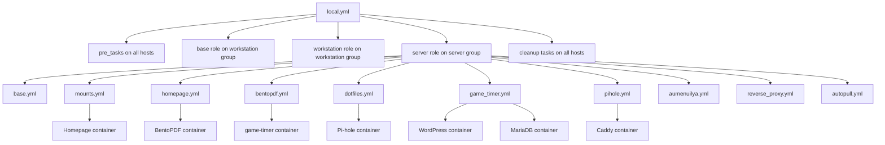

# Architecture Guide

## Big Picture

This repository currently has two layers living side by side:

- the older workstation-oriented structure inherited from the earlier repo shape
- the newer server-focused path that has been refactored back into `local.yml` + `roles/server`

The canonical execution entry point is now `local.yml`.

## Top-Level Files

### `local.yml`

Main playbook.

- `all` pre-task refreshes apt only on Debian-family systems TODO:  adapt to arch systems? <!-- TODO: Adapt to Arch systems ? -->
- `workstation` hosts run the old `base` role
- `workstation` hosts then run the old `workstation` role
- `server` hosts run the newer aggregated `server` role
- `all` cleanup tasks finish the run

This file is the closest match to the LearnLinuxTV-style structure you referenced.

### `server_core.yml`

Compatibility wrapper.

- It exists so the server path can still be invoked explicitly
- It now simply calls the `server` role
- `local.yml` is the more important entry point

### `hosts`

Static inventory.

- `[server]`: `raspberrypi`, `serverannah`, `archlinux`
- `[workstation]`: the desktop/laptop hosts

`archlinux` is the disposable VM used as the feedback loop host.

### `ansible.cfg`

Repository-local Ansible defaults.

- inventory file is `hosts`
- logs go to `/var/log/ansible.log`
- retry files are disabled

This matters because `scripts/bootstrap-server.sh` and the autopull helper both export `ANSIBLE_CONFIG` so `ansible-pull` uses repo-local inventory and settings.

### `requirements.yml`

Explicit collection dependencies:

- `community.general`
- `community.docker`

These are needed for modules like `community.general.snap`, `community.general.pacman`, and Docker resource modules.

## Host-Specific Vars

### `host_vars/serverannah`

Real headless Ubuntu server profile.

Defines:

- `ansible_connection: local`
- `autoconfig_branch`
- `autoconfig_playbook`
- which server subservices are enabled
- reverse proxy hostnames and upstreams
- AuMenuIlYA backup source path
- structured storage mount data in `server_storage_mounts`

This file is where the server personality lives.

### `host_vars/archlinux`

VM test profile.

Defines:

- the same local-connection model as `serverannah`
- VM-only hostnames like `*.localtest.me`
- non-conflicting ports like `8081` and `5300`
- enabled services for VM validation

This file exists to prove portability and idempotency without touching the real server.

## The `roles/server` Role

This is now the main server orchestration role.

### `roles/server/tasks/main.yml`

Dispatch file.

It imports the server task files in a flat and explicit order:

1. `base.yml`
2. `mounts.yml`
3. `homepage.yml`
4. `bentopdf.yml`
5. `dotfiles.yml`
6. `game_timer.yml`
7. `pihole.yml`
8. `aumenuilya.yml`
9. `reverse_proxy.yml`
10. `autopull.yml`

Each optional service is guarded by a host var such as `server_homepage_enabled`.

### `roles/server/defaults/main.yml`

Server role defaults.

This file is important because it holds:

- distro-specific package maps for Debian and Arch
- service defaults for Homepage, BentoPDF, game-timer, Pi-hole, AuMenuIlYA, reverse proxy, and autopull
- secret file locations
- network names, ports, and container names

This is the main schema of the server role.

### `roles/server/tasks/base.yml`

Server foundation.

Responsibilities:

- assert supported OS family
- choose package names from `server_packages_by_family`
- refresh package metadata without creating noisy idempotency drift
- install CLI tools
- install Docker
- enable and start Docker

This file intentionally does not include application-specific logic.

### `roles/server/tasks/homepage.yml`

Deploys Homepage.

- creates the app directory
- deploys a stow-like config tree from `files/homepage/opt/homepage/config/`
- creates/uses the shared Docker network
- starts the Homepage container

### `roles/server/tasks/mounts.yml`

Storage foundation for hosts with extra disks.

Responsibilities:

- create the mount point directories
- manage the corresponding `/etc/fstab` entries
- ensure the filesystems are mounted now, not just declared for later boot

This task file is driven by `server_storage_mounts` in host vars.

### `roles/server/tasks/bentopdf.yml`

Deploys BentoPDF as a simple Dockerized service on the shared network.

### `roles/server/tasks/game_timer.yml`

Deploys the second website.

- clones `game-timer` from GitHub
- serves it through `nginx:alpine`
- exposes it only through the shared Docker network by default

This is the current pattern for plain static sites.

### `roles/server/tasks/dotfiles.yml`

First Stow-based dotfiles slice.

Current responsibilities:

- ensure the target user home exists
- clone the public `omarchy-dotfiles` repo into a user-scoped checkout
- run `stow --restow` for the host-selected package list

Current scope is intentionally conservative:

- enabled on `serverannah` and `archlinux`
- first package is `bash`
- risky packages such as `ssh` or Hyprland are not auto-stowed yet

### `roles/server/tasks/pihole.yml`

Deploys Pi-hole.

- manages the Pi-hole config and secret directories
- generates the web password on the target host
- starts the Pi-hole container
- relies on Caddy only for the admin UI, not for DNS traffic itself

### `roles/server/tasks/aumenuilya.yml`

Deploys the WordPress site.

Responsibilities:

- validate the host-local backup source exists
- sync `wp-content`
- restore `.htaccess` and `ads.txt`
- create target-side DB secrets
- run MariaDB container
- import SQL only if the DB is not already initialized
- run WordPress container
- rewrite URLs with WP-CLI only when needed

This is not a simple “docker up” file. It is restore automation encoded in Ansible.

### `roles/server/tasks/reverse_proxy.yml`

Deploys Caddy.

- creates config/data directories
- renders the `Caddyfile`
- runs the Caddy container
- restarts the container when the config changes

### `roles/server/tasks/autopull.yml`

Installs the recurring `ansible-pull` automation.

- installs `/usr/local/bin/autoconfig-pull`
- installs a `systemd` service and timer
- reloads systemd
- enables the timer

### `roles/server/templates/Caddyfile.j2`

Host-driven reverse proxy config.

Each site entry in `server_reverse_proxy_sites` can either:

- proxy to an upstream container
- redirect to a canonical hostname

### `roles/server/templates/autoconfig-pull.*`

These files define the recurring self-management layer.

- shell helper to clone/update repo and run `ansible-pull`
- systemd service
- systemd timer

### `roles/server/handlers/main.yml`

Currently contains `Reload systemd`.

## `files/`

Static payloads managed by Ansible.

Most important current subtree:

- `files/homepage/opt/homepage/config/`

This is intentionally close to a stow-like package layout already, which makes future reuse easier.

There are also older workstation-oriented payloads still present, such as:

- shell config files
- Espanso snippets
- Betterbird profile material
- rclone files

Those are not yet normalized into the newer server path.

## `scripts/bootstrap-server.sh`

First-run bootstrap helper for fresh servers.

Responsibilities:

- detect Debian-family vs Arch-family host
- install `git` and `ansible-core`
- clone or update the repo
- install required collections
- export `ANSIBLE_CONFIG`
- run `ansible-pull`

This is the bridge between a blank server and a self-managing one.

## `backups/`

Repository-side capture of important host configuration.

Currently added:

- `backups/serverannah/etc/fstab`

This is a raw reference copy, not yet an applied task.

## Legacy Areas Still Present

The repo still contains older layers that matter:

- `roles/base/`
- `roles/workstation/`
- older `files/` payloads
- `group_vars/all`

These are kept because the repository is being refactored incrementally, not rewritten from scratch.

## Current Execution Logic

The practical flow is:

1. `ansible-pull` runs `local.yml`
2. inventory groups decide whether the host is `workstation` or `server`
3. `server` hosts enter `roles/server/tasks/main.yml`
4. host vars decide which server services are active
5. Caddy fronts whichever services are enabled
6. `autopull` installs the recurring self-update timer

## Dotfiles Direction

This repo is not yet the dotfiles source of truth, but it is now structured so that can happen gradually.

The safest future path is:

1. move dotfiles into package-like directories under this repo
2. install `stow` with Ansible
3. have Ansible call `stow` on selected packages per host profile
4. keep secrets and highly host-specific files out of the generic stow set

That keeps Ansible as the orchestrator and Stow as the placement mechanism.

The first real implementation of that path now exists in `roles/server/tasks/dotfiles.yml`, but it still points at the external public repo until the packages are migrated into this repository.
